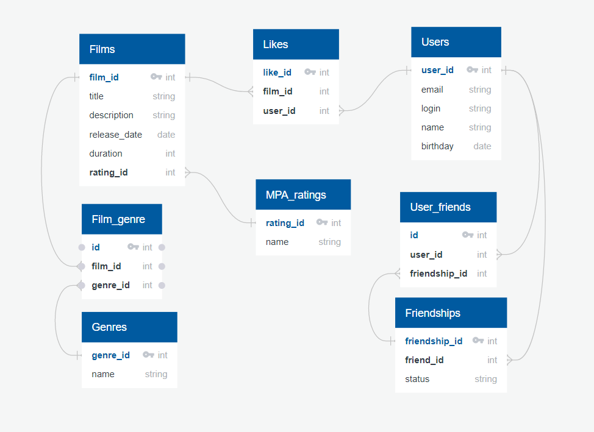

# java-filmorate
Repository for Filmorate project.

## Database scheme


### Request examples

1. Get all genres for each film
    ```roomsql
    SELECT f.title,
        g.name
    FROM films as f
    LEFT JOIN film_genre as fg ON f.film_id=fg.film_id
    LEFT JOIN genres as g ON fg.genre_id=g.genre_id 
    ```
2. Get all friends names for each user
    ```roomsql
    SELECT u.name,
        fu.name
    FROM users as u
    LEFT JOIN user_friends as uf ON u.user_id=uf.user_id
    LEFT JOIN friendships as f ON uf.friendship_id=f.friendship_id
    LEFT JOIN users as fu ON f.friend_id=fu.user_id 
    ```
